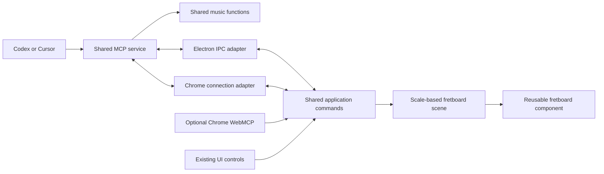

**Jam Dashboard: music tools and agent-controlled visualizations**

Review date: September 19, 2026. Revised after scope feedback. Status: approved and implemented for V1. See [setup and implementation notes](agent-tools.md) for the shipped contract and verification limits.

The first release must work in both the Electron desktop app and the web app in Chrome. Use one shared MCP service implementation, music module, tool registry, and application controller, with small platform adapters. Given the desktop preference, prove the connection there first and add the Chrome connection before expanding the music features. A future built-in agent can call the same shared functions directly.

The first demonstration should be deliberately small: ask an agent to select D major, see the existing picker and fretboard update, and receive the applied state back. Then extend that path to scale-compatible note selections, exact string/fret positions, the existing CAGED controls, and a basic collection of chord voicings.

Accepted scope constraints: visualization requires a selected scale; highlighted notes and chords must fit that scale; chord detection treats the first supplied note as the bass; and voicing generation starts as a simple, replaceable module. Native Chrome WebMCP may expose the same page actions, but desktop support must not depend on that browser API.

**Baseline reviewed before implementation**

| Area              | Current implementation                                                                                                                                          | Consequence for this project                                                                                                   |
| ----------------- | --------------------------------------------------------------------------------------------------------------------------------------------------------------- | ------------------------------------------------------------------------------------------------------------------------------ |
| Web app           | React 18, Remix 2, Vite, Tailwind, and shadcn/Radix components. The main route combines the header, fretboard controls, and tool tabs.                          | Reuse the current app and presentation. A framework rewrite is unnecessary.                                                    |
| Desktop           | Electron loads a static build at `jam://dashboard/`. Main/preload IPC currently serves the local audio analyzer.                                                | Extend this IPC pattern and host the shared MCP service in Electron's main process. Desktop is an initial release requirement. |
| Music theory      | Installed Tonal 6.4.0 supplies notes, chords, scales, intervals, and chord detection. Local utilities supply chord lists, tunings, and CAGED coloring.          | Extract and validate a focused music API around these libraries.                                                               |
| Fretboard         | `FretBoard` accepts tuning, fret count, starting fret, handedness, and a label toggle. Its `Fret` children read three React contexts to decide what to display. | The visual component cannot yet render an independent note selection or multiple independent boards from props.                |
| Key and settings  | `ScaleKeyContext` owns key/scale and derived notes; `SettingsContext` owns presentation settings, persisted in localStorage.                                    | These are useful starting points for a shared command interface.                                                               |
| Other state       | Tuning and starting fret live in `FretboardControls`; chord selection lives in `ChordExplorer`; active tab is uncontrolled.                                     | An agent needs a complete state snapshot and shared setters for the controls it can operate.                                   |
| Chord display     | `ChordExplorer` highlights chord pitch classes throughout the neck and plays an ascending arrangement of chord notes.                                           | It does not generate individual guitar voicings or fingerings.                                                                 |
| Chord recognition | `NoteDetector` already calls `Chord.detect`, inside a React hook alongside scale matching.                                                                      | Recognition can become a tool without using the microphone or mounting React.                                                  |
| CAGED             | `cagedShapeUtils` selects pentatonic indices by string; `cagedColorUtils` colors them. There is no fret-position/anchor argument.                               | Expose the existing coloring controls initially. Exact CAGED pattern templates are a later extension.                          |
| Agent integration | No MCP server, app command API, or live session bridge is present.                                                                                              | This is new integration work, rather than configuration of an existing endpoint.                                               |

Useful entry points: [FretBoard](../app/components/FretBoard/FretBoard.tsx), [Fret](../app/components/Fret/Fret.tsx), [fretboard controls](../app/components/FretboardControls/FretboardControls.tsx), [highlight state](../app/contexts/HighlightContext.tsx), [chord explorer](../app/components/ChordExplorer/ChordExplorer.tsx), [note detector](../app/components/NoteDetector/NoteDetector.tsx), [CAGED utilities](../app/utils/cagedShapeUtils.ts), [desktop main](../desktop/main.cjs), and [desktop preload](../desktop/preload.cjs).

Several current assumptions need to be addressed at the new API boundary:

- Chord highlighting maps over the selected scale's notes. Keep that scope and validate it explicitly: reject out-of-scale requests rather than silently hiding notes. Use pitch-class equality so equivalent spellings are accepted.
- `Fret` chooses CAGED rendering ahead of normal highlighting. An explicit visualization mode must resolve competing selections predictably.
- Tuning values are pitch classes without octaves. They suffice for a neck map but do not identify the actual bass pitch or inversion of a voicing.
- The UI uses string 1 at the top, normally high E. Some stories use the opposite tuning order. The API needs one documented convention.
- Open strings are represented by tuning inputs outside `FretBoard`; its first rendered fret is `startingFret + 1`. A self-contained voicing display needs fret 0, muted strings, and visible fret numbers.
- Scale-degree labels come from a seven-item array and exact note lookup. Preserve the scale-based labels, while fixing enharmonic lookup where sharp-normalized CAGED notes can miss flat-spelled scale entries. General chromatic interval labels are not a first-release prerequisite.
- The handwritten note parser treats unknown modifiers as zero rather than rejecting them. `Note.simplify` elsewhere does not make `Db` and `C#` equal. Use validated Tonal notes and chroma/MIDI for comparisons, retaining the appropriate spelling for display.
- Settings are validated when loaded, but `updateSettings` merges unchecked values. The UI permits up to 12 strings while the stored schema permits 8. Reconcile this before defining public limits.

These are focused prerequisites for reliable tools, not a proposal to refactor unrelated audio or analyzer functionality.

**Baseline verification performed during review**

`npm test -- --runInBand`: 9 suites, 79 tests passed. `npm run desktop:test`: 12 tests passed. `npm run build`: passed, with existing Browserslist-age and sourcemap warnings. `npm run typecheck`: failed in four existing Storybook files: obsolete `highlightedNotes` props on Fret/FretBoard stories, an obsolete Storybook `Story` import, and missing methods in the NoteDetector mock.

The local web app was opened and its current fretboard and controls inspected. The packaged desktop app and native Swift tests were not exercised in this review. The desktop architecture was reviewed from source. No application source was changed for this review.

**Shared architecture for desktop and Chrome**

Use ordinary TypeScript modules in this repository; extracting a published package or creating an npm monorepo is unnecessary initially.

MCP is the external adapter. Share its schemas, tool definitions, music functions, command handling, and visualization components. The platform-specific code only transports commands and owns service startup/shutdown. Each app instance retains its own state; shared implementation does not imply synchronization between the user's desktop and browser views.

| Environment                          | Implementation                                                                                                                                                                                                                                                                                                                      |
| ------------------------------------ | ----------------------------------------------------------------------------------------------------------------------------------------------------------------------------------------------------------------------------------------------------------------------------------------------------------------------------------- |
| Electron desktop                     | First demonstration. Electron main hosts the MCP service; a narrow preload/IPC adapter routes commands to the shared React controller. Bundle server dependencies because the current builder excludes `node_modules`. Opening the installed app should be sufficient to run its integration, without a separate Node installation. |
| Chrome + local web app               | Required for the first release. Run the same service as a standalone local process and connect the page through an authenticated WebSocket adapter. Provide a development command that starts the UI and service together.                                                                                                          |
| Chrome-native WebMCP                 | A small additional adapter can register the same tool definitions in the page and call the shared handlers directly. Test on a supported Chrome configuration; do not build a browser extension or polyfill as part of this work.                                                                                                   |
| Hosted website + local/cloud control | Outside the first release. The initial web target is the app served locally in Chrome. Hosted HTTPS-to-local pairing or a remote relay needs separate connection/authentication work. WebMCP registration can later travel with the hosted page, subject to browser/agent support.                                                  |

Use **Streamable HTTP on loopback** as the common external MCP connection in both modes. Electron uses IPC internally; Chrome uses the application WebSocket channel. Both [Codex](https://developers.openai.com/codex/mcp) and [Cursor](https://cursor.com/docs/mcp) document Streamable HTTP and stdio support. The approved `npm run agent:dev` command would start the web UI and service together; desktop exposes connection information from the app. The implemented endpoints and setup are documented in [agent-tools.md](agent-tools.md).

Use the same server module in Electron and the standalone web entry point. Give simultaneously running hosts explicit, configurable endpoints and surface port conflicts; do not silently connect to the wrong app. Add stdio only if a target client needs it. Use the official MCP SDK and verify its schema dependencies against the app's current Zod 3.24.1. See the [official TypeScript SDK](https://ts.sdk.modelcontextprotocol.io/v2/).

The React controller in each page/window remains the authority for its live view. The service tracks app sessions and forwards commands; its cached state is a mirror. Theory queries do not require a rendered page, provided the service is running. Display commands require a connected session and selected scale.

Chrome-only support narrows browser testing but does not make WebMCP and standard MCP interchangeable. Chrome currently documents WebMCP through an origin trial or a local development flag, and an agent still needs a way to discover and call page tools. The regular MCP path works through our own bridge regardless of native WebMCP availability. Do not assume Electron exposes Chrome's WebMCP integration simply because it embeds Chromium. See [Chrome's WebMCP documentation](https://developer.chrome.com/docs/ai/webmcp). Desktop follows the existing [Electron context bridge](https://www.electronjs.org/docs/latest/api/context-bridge) pattern.

**Shared data and behavior**

Require a valid selected scale for visualization. The agent may select it through `set_view` before a display request; the existing default C major is already a valid selection. If the scale is cleared, return `SCALE_REQUIRED`. If requested notes/chord tones do not fit, return `NOTES_OUTSIDE_SCALE` with the offending notes, leaving the view unchanged. The agent can then explicitly select a suitable scale. Do not silently filter notes or change scales.

Refactor rendering only far enough to accept resolved scale-compatible markers and exact string/fret selections, with one selected voicing on the existing board and Next/Previous/result controls. A versioned app snapshot includes the selected scale, tuning, range, and exact positions. The app wrapper keeps using the normal controls and existing coloring. A fully general chromatic canvas is outside the first release.

Support note subsets, meaning every matching occurrence within the selected scale/range, and exact positions, meaning only those string/fret coordinates. Both paths apply the same scale-membership check. A scale change clears incompatible selections; a tuning change clears old exact positions/voicings. Pure `identify_chord` and lookup functions can still answer questions independently of the display selection.

The initial contract should specify:

- String numbers start at 1 in the existing top-row order. Standard six-string tuning is `E4, B3, G3, D3, A2, E2` in that order. Handedness changes presentation, not physical string identifiers.
- Fret 0 means open; mute is a separate value. A voicing has at most one sounding position per string, while a scale-note visualization can show several.
- Fret bounds are inclusive. Avoid carrying the current `startingFret + 1` ambiguity into the tools.
- Theory calculations compare chroma for pitch classes and MIDI for register/bass. Display spelling is preserved or derived from chord/scale context.
- Keep current tuning support for scale visualization. Start voicing search with six-string E standard and its known pitches; report unsupported tunings explicitly until the module is extended. This avoids making octave-entry UI a prerequisite.
- Preserve note-name/scale-degree labels and existing palette choices. Additional interval-label and styling features can follow later.
- The first supported instrument range should match the stored 4–8 string limit and 0–24 frets. If 9–12 strings are a desired requirement, raise both UI and schema limits together with explicit search budgets.

Use one validated command/reducer path for key, scale, tuning, visualization mode, selected chord/voicing, fret range, and exposed tab/presentation state. Existing context hooks can act as compatibility facades while state is consolidated. Audio jobs and unrelated UI state need not move into this controller.

State changes are atomic: selecting a new scale and CAGED mode must not leave stale chord highlights in control. Manual changes publish the same state updates as agent changes. Keep derived notes out of independently editable state where practical. Initialize saved preferences before accepting commands, and distinguish persistent display preferences from temporary scenes and voicing results.

Each connected page has an app session ID and a state revision. Commands carry a request ID and optionally an expected revision. Return success only after the page acknowledges the applied revision and React commits the corresponding view; returning “command sent” is insufficient. A stale revision yields a conflict the agent can resolve by reading current state. Duplicate request IDs must not apply twice. On disconnect or acknowledgement loss, report an unknown/unconfirmed outcome and let the agent read back state instead of blindly retrying.

**Proposed tool surface**

Use a small set of named operations, each with input/output schemas, examples, descriptions, and appropriate read-only/mutation annotations. Share the definitions and validation between adapters. The service should expose music capabilities, not arbitrary Tonal method execution or general JavaScript evaluation.

| Tool               | Purpose                                                                                                                     | Changes the view? |
| ------------------ | --------------------------------------------------------------------------------------------------------------------------- | ----------------- |
| `get_capabilities` | Supported tunings, scale/chord types, modes, limits, and contract version.                                                  | No                |
| `list_sessions`    | Connected pages and their readiness; choose the intended target explicitly if there are several.                            | No                |
| `get_state`        | Current key, scale, tuning, mode, selection, scene, and revision for a page.                                                | No                |
| `identify_chord`   | Candidate chord names, notes, and intervals; the first supplied note is the bass.                                           | No                |
| `get_chord`        | Resolve a chord symbol into validated notes and intervals.                                                                  | No                |
| `get_scale`        | Resolve a tonic/scale and optionally its compatible chords using existing curated types.                                    | No                |
| `find_voicings`    | Return a small bounded collection from the independent basic voicing module, with applied limits and completeness metadata. | No                |
| `set_view`         | Atomically set supported dashboard selections, including key/scale, tuning, labels, and current CAGED coloring.             | Yes               |
| `show_fretboard`   | Display a subset of the selected scale or exact scale-compatible positions.                                                 | Yes               |
| `show_voicings`    | Display a bounded voicing array with a selected item, validated against the current scale and tuning.                       | Yes               |

`set_view` also provides a clear route back to the normal scale view. More theory tools, such as matching scales from notes or transposition, can be added after these workflows work. A capability/catalog resource is useful, but essential discovery should also be available as a tool so clients need not support every MCP resource feature.

Return structured results plus a short readable explanation. Display results include the target session, applied revision, and normalized selection. Invalid notes, missing scales, out-of-scale notes, unsupported tunings, disconnected pages, conflicts, and search limits are explicit results. There is no need for a query-result cache or cursor protocol in the basic voicing release.

For chord identification, use the agreed contract: the first supplied note is the bass. Preserve that order when normalizing spellings and removing duplicate pitch classes, and call Tonal's existing detector. Return its candidates without adding unordered-set inference or a confidence model. The first-note convention applies even if the supplied notes include octave labels; physical bass calculation in the voicing module is a separate operation.

**Voicing search and CAGED scope**

Tonal's installed `Voicing.search` produces note arrays from interval dictionaries and pitch ranges. It does not return guitar string/fret arrangements or enforce hand stretch. A dedicated guitar-position search is therefore part of this work.

Create a separate pure module, for example `shared/music/voicings/`, with a stable `findVoicings(query)` interface and plain JSON results. UI components and tool handlers call it; neither embeds search logic. Return the algorithm version and resolved constraints so the strategy can be improved later without changing the renderer or MCP contract.

Start with six-string E standard, frets 0–12 by default, and a maximum fretted span of 4 (highest fretted position minus lowest). Permit open and muted strings; require every distinct chord tone, allow duplicated tones, and allow at most one sounding position per string. Generate positions, prune invalid combinations, and return a deterministic bounded list, initially up to 20 results. Support a slash-chord bass by comparing the actual sounding pitches in the known tuning. Other tunings and advanced omission/fingering rules can be added behind the same interface.

Keep computation and result limits explicit. Stop at a bounded amount of work or the result cap and report `complete: false` and a stop reason whenever the search was not exhausted. Open strings do not count toward fretted span. Impossible requests return an explanatory empty result. Do not claim that the first batch contains every possible voicing or that the results guarantee comfortable fingering. Advanced ranking, exhaustive paging, caches, finger assignment, barre analysis, and worker infrastructure are deferred unless measurement shows a worker is needed even for the bounded initial search.

The view should show one selected voicing on the large board with Next/Previous/result selection, open/muted strings and fret numbers. Multiple boards are deferred. It receives explicit voicing data; there is no need for server-side result IDs initially. Validate the complete chord against the selected scale before rendering the collection.

CAGED scope is the current UI: select key/scale, enable the mode, and choose C, A, G, E, D, or ALL. Preserve its known best-effort behavior for alternate tunings and report unsupported scale coloring clearly. Exact positional CAGED templates and chord-grip libraries are deferred; basic voicings use their own module.

**Recommended implementation order**

1. **Establish the shared contract and baseline.** Fix the four Storybook type errors; define note/scale validation, state commands, tool schemas, and an app-bridge interface implemented by both environments. Retain scale-based rendering and the first-note-as-bass convention. Acceptance: existing tests/build pass, typecheck is green, and shared modules have no Electron, DOM, or audio dependency.

2. **Prove desktop MCP control.** Add the shared controller/service and the Electron main/preload adapter. Start with `get_capabilities`, `list_sessions`, `get_state`, `get_scale`, and `set_view`. Include service packaging, connection information, targeting, authentication, and acknowledgement. Acceptance: an agent selects D major and an existing CAGED shape in the running desktop app, and manual changes are visible through `get_state`.

3. **Prove the same tools in Chrome.** Add the standalone entry point for the same service and a browser bridge to the same controller. Provide local startup/configuration and feature-detected Chrome WebMCP registration over those handlers as an additional entry point. Acceptance: the same MCP calls produce equivalent state in Chrome and Electron; neither path relies on the other app being open, and absent native WebMCP does not break the standard MCP path. This milestone is required before calling the platform integration complete.

4. **Add music queries and basic voicings.** Extract the Tonal wrappers; add scale-compatible note/position rendering; implement the independent basic voicing module and a result selector for the existing board. Add `identify_chord`, `get_chord`, `show_fretboard`, `find_voicings`, and `show_voicings`. Acceptance in both platforms: select C major, identify C–E–G, find basic C-major voicings, display them, and select one. Missing/out-of-scale selections and unsupported voicing tunings return clear errors.

5. **Verify and package both targets.** Test the workflow through real agent connections, plus reloads, multiple sessions, conflicts, duplicate commands, and invalid input. Verify the installed desktop build includes the service and works without a developer Node process. Document Chrome/local web and desktop setup, including the chosen Chrome WebMCP test configuration. Acceptance: both modes work from their documented setup, normal builds remain healthy, and the exact identify → find → display workflow passes on each.

Tests and documentation accompany each step; step 5 validates the combined experience rather than postponing correctness until the end. Keep each step independently reviewable. The voicing search is the largest new domain feature; the first live-control demonstration should not wait for it.

**Local connection requirements**

Bind the service to loopback, validate Host/Origin, authenticate MCP and browser bridge connections, and keep credentials in private app data or ignored local configuration. The local launcher supplies browser credentials through a same-origin development endpoint, with no credentials in URLs. Public-site pairing is deferred. Desktop IPC accepts only the trusted bundled frame and exposes named command/state methods. Preserve sandboxing, context isolation, and the renderer's current CSP. Display connection status and provide a disconnect control. These follow the local-service guidance in the [MCP transport specification](https://modelcontextprotocol.io/specification/2026-07-28/basic/transports/streamable-http).

The local agent mode should disable third-party ads, analytics, and feedback/session recording. The current web entry initializes PostHog even during local development, with input masking disabled. Agent connection credentials and command payloads must not enter that telemetry. Reuse the desktop build's existing distinction between the local tool experience and hosted integrations where practical.

Only documented music/display commands cross this connection. Payload sizes and computation are bounded. Reload/HMR removes old listeners and registrations; session readiness is re-established before commands resume. If multiple pages/windows are open, target their IDs rather than broadcasting. A service restart invalidates old session IDs explicitly.

**Validation that determines completion**

| Scenario                      | Required evidence                                                                                                                                                                                                                           |
| ----------------------------- | ------------------------------------------------------------------------------------------------------------------------------------------------------------------------------------------------------------------------------------------- |
| Chord identification          | Triads/sevenths, enharmonic spellings, ambiguous candidates, first-note bass handling, invalid notes, and empty input behave as documented.                                                                                                 |
| Scale-based visualization     | Missing scales and out-of-scale notes are rejected; enharmonic equivalents are accepted; valid note subsets, exact positions, open/muted strings, and handedness render correctly.                                                          |
| Voicing correctness           | Every sounding note belongs to the chord; required tones are present; bass, bounds, and span constraints hold. Compare a small search with an exhaustive reference. Unsupported tunings return a clear result.                              |
| Voicing limits                | No duplicate assignments; deterministic results; early limits report incompleteness; the module works without React or MCP.                                                                                                                 |
| CAGED                         | Existing C/A/G/E/D/ALL controls and coloring remain consistent under manual and agent control.                                                                                                                                              |
| State synchronization         | Human and agent edits use the same state; a tool succeeds only for the acknowledged revision; no duplicate application or accidental tab broadcast.                                                                                         |
| Connection lifecycle          | Closed app, disconnect/reconnect, reload, timeout, stale revision, credential failure, port conflicts, and host shutdown are understandable and recoverable.                                                                                |
| Regression                    | Existing Jest and desktop tests, typecheck, web build, desktop renderer build, and stories remain usable. New utilities receive Jest tests and new UI components receive stories, per `.cursorrules`.                                       |
| Platform/client compatibility | Live MCP connections and the full select scale → identify → find → display workflow run in Chrome and the installed Electron app, including Codex/Cursor setup checks. Test native WebMCP separately on its supported Chrome configuration. |

**Later extensions**

Extend the voicing module with alternate tunings, more strings, inversion/omission policies, improved ranking, and larger or exhaustive searches as needed. Add exact positional CAGED templates and fully chromatic rendering only when requested. Desktop and Chrome MCP support are already part of the first release, not later extensions.

Add PNG/SVG export or an MCP app UI when inline chat diagrams become a priority. The first release displays in Jam Dashboard and returns structured state; generic MCP support alone does not guarantee an interactive React component inside an agent's chat. Preserve the same scene/renderer so export does not develop different music behavior.

A built-in agent can later call the shared music functions and application commands through its own tool runner, adding conversation UI and model access without reimplementing the capabilities. Hosted cross-device control requires a separate authenticated relay and user/session ownership design. Audio playback tools, microphone/analyzer control, automatic fingering, package publication, and cloud agent hosting are outside the first release.

The revised proposal is: desktop demonstration first, Chrome parity next, one shared MCP/tool/controller implementation with small platform adapters, a required scale for visualization, first-note-as-bass detection, and a deliberately basic voicing module. Both desktop and Chrome must pass the full workflow before the first release is complete.
